# Reporte 1

En este reporte se documentan distintas prácticas realizadas con un Arduino UNO. A través de ejercicios sencillos se trabajó con entradas y salidas digitales, señales analógicas y componentes mecánicos, con el propósito de comprender de manera práctica cómo responde el microcontrolador ante diferentes circuitos y programas.

#  Arduino, ¿Qué es?

Arduino es una plataforma de desarrollo de hardware y software de código abierto utilizada para crear proyectos electrónicos y prototipos interactivos. Sus placas integran un microcontrolador que puede recibir información de sensores o botones y, a partir del programa cargado, controlar elementos como LEDs, displays y servomotores.

La programación se realiza normalmente desde el Arduino IDE utilizando una sintaxis basada en C/C++. Existen distintos modelos de placas, pero el Arduino UNO es uno de los más utilizados para aprender electrónica y programación por su facilidad de uso y la cantidad de recursos disponibles.
# Lista de materiales:

## Arduino UNO:
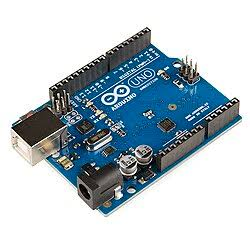
## Cable USB-A a USB-B:

## Protoboard:
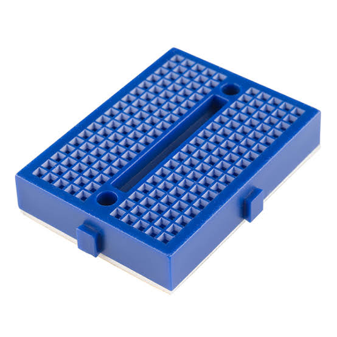
## Jumpers:
## Jumper MACHO HEMBRA
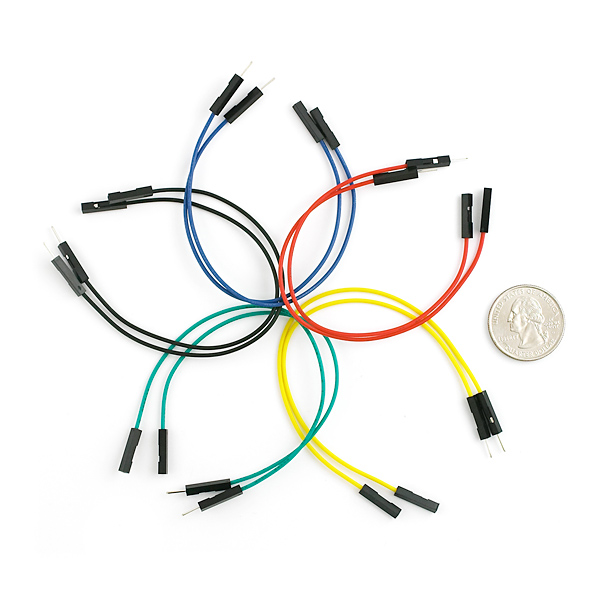


## JUMPER MACHO MACHO
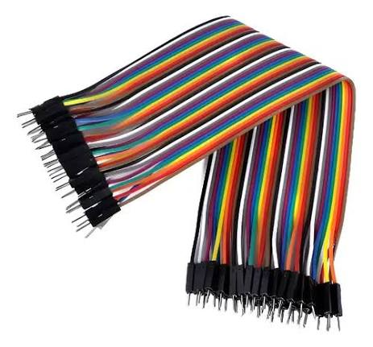


## Jumper HEMBRA HEMBRA
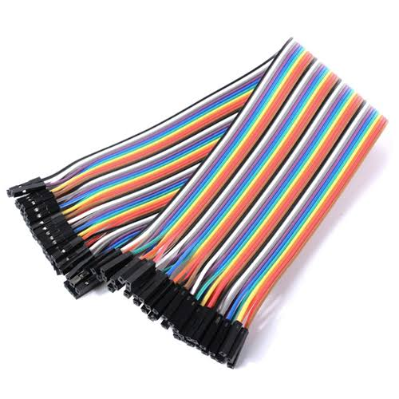
## LED:
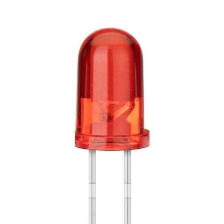
## Resistencias:
## Resistencia 1k Ohm
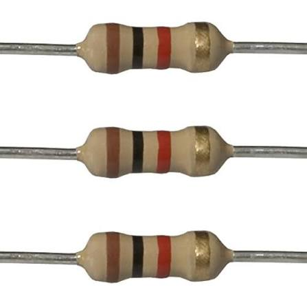 


## Resistencia 20k Ohm
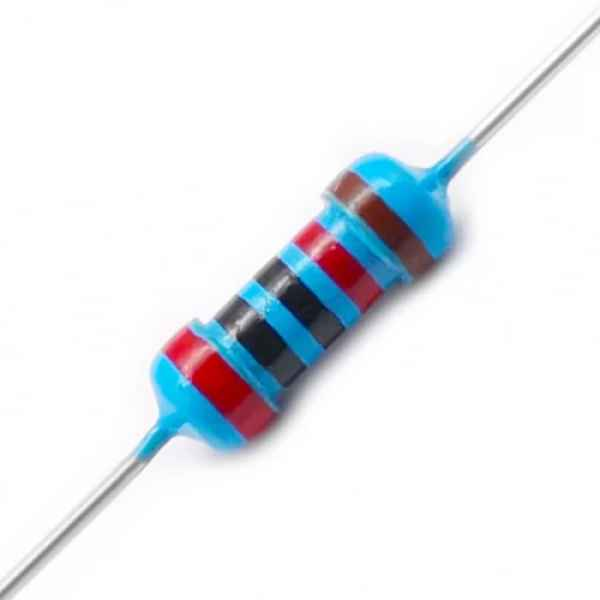 
## Display de segmentos:
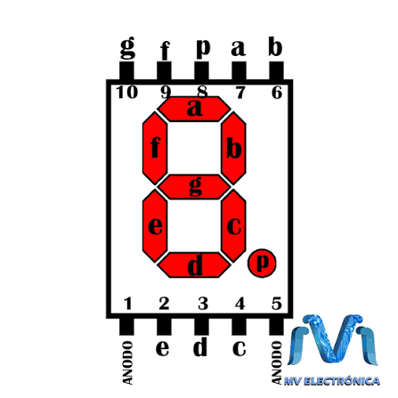
## Servomotor:
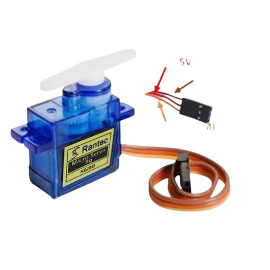
## Potenciómetro:
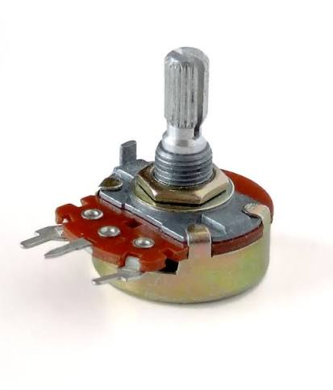
## Boton:
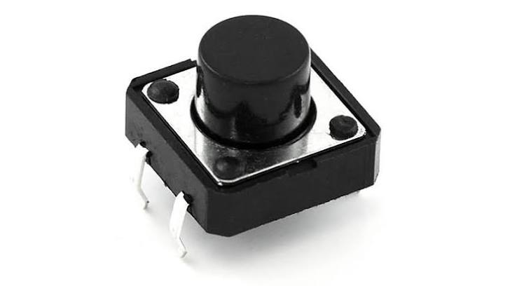

# reporte

## 00 Prueba parpadeo PIN

En esta primera prueba se verificó el funcionamiento básico de la tarjeta Arduino mediante el LED integrado. El programa enciende y apaga el LED cada segundo, por lo que sirve para comprobar que la placa está ejecutando correctamente el código cargado.

Código de la práctica:

```cpp
// C++ code
//
void setup()
{
  pinMode(LED_BUILTIN, OUTPUT);
}

void loop()
{
  digitalWrite(LED_BUILTIN, HIGH);
  delay(1000); // Wait for 1000 millisecond(s)
  digitalWrite(LED_BUILTIN, LOW);
  delay(1000); // Wait for 1000 millisecond(s)
}
```

## 01 PIN_13_HIGH

En esta práctica se configuró el pin 13 como una salida digital y se mantuvo en estado `HIGH`. Como resultado, el LED conectado a ese pin permanece encendido de forma continua mientras el programa está en ejecución.

Código de la práctica:

```cpp
// C++ code
//
void setup()
{
  pinMode(13, OUTPUT);
}

void loop()
{
  digitalWrite(13, HIGH);
}
```

## 02 PIN_13

En este ejercicio se trabajó nuevamente con el pin 13, pero ahora se estableció permanentemente en estado `LOW`. De esta forma se comprobó cómo apagar una salida digital desde el programa.

Código de la práctica:

```cpp
// C++ code
//
void setup()
{
  pinMode(13, OUTPUT);
}

void loop()
{
  digitalWrite(13, LOW);
}
```

## 03 Delay

Aquí se utilizó la función `delay()` para controlar el tiempo entre el encendido y el apagado del LED. Se estableció una espera de 1000 milisegundos en cada estado, generando un parpadeo regular de un segundo.

Código de la práctica:

```cpp
// C++ code
//
void setup()
{
  pinMode(13, OUTPUT);
}

void loop()
{
  digitalWrite(13, HIGH);
  delay(1000); // Wait for 1000 millisecond(s)
  digitalWrite(13, LOW);
  delay(1000); // Wait for 1000 millisecond(s)
}
```

## 04 Led parpadeando

En esta prueba se conectó un LED y se programó una secuencia de encendido y apagado. El objetivo fue observar directamente cómo una salida digital del Arduino puede controlar un componente externo siguiendo un intervalo de tiempo definido.

Código de la práctica:

```cpp
// C++ code
//
void setup()
{
  pinMode(13, OUTPUT);
}

void loop()
{
  digitalWrite(13, HIGH);
  delay(1000); // Wait for 1000 millisecond(s)
  digitalWrite(13, LOW);
  delay(1000); // Wait for 1000 millisecond(s)
}
```

## 05 Circuito con resistor para Led

Para esta práctica se agregó una resistencia en serie con el LED con el fin de limitar la corriente y proteger el componente. El programa conserva la secuencia de parpadeo, mientras que el circuito incorpora una conexión más adecuada para trabajar con el LED.

Código de la práctica:

```cpp
// C++ code
//
void setup()
{
  pinMode(13, OUTPUT);
}

void loop()
{
  digitalWrite(13, HIGH);
  delay(1000); // Wait for 1000 millisecond(s)
  digitalWrite(13, LOW);
  delay(1000); // Wait for 1000 millisecond(s)
}
```

## 06 Circuito con dos LEDs alternando

En este circuito se emplearon dos LEDs controlados desde los pines 13 y 12. El programa enciende primero un LED, lo apaga y posteriormente realiza la misma secuencia con el segundo, creando un efecto de alternancia entre ambos.

Código de la práctica:

```cpp
// C++ code
//
void setup()
{
  pinMode(13, OUTPUT);
  pinMode(12, OUTPUT);
}

void loop()
{
  digitalWrite(13, HIGH);
  delay(1000); // Wait for 1000 millisecond(s)
  digitalWrite(13, LOW);
  delay(1000); // Wait for 1000 millisecond(s)
  digitalWrite(12, HIGH);
  delay(1000); // Wait for 1000 millisecond(s)
  digitalWrite(12, LOW);
  delay(1000); // Wait for 1000 millisecond(s)
}
```

## 07 Circuito con dos LEDs emparejados

En esta práctica se buscó que los LEDs trabajaran con el mismo ritmo de encendido y apagado. La señal generada en el pin 13 cambia entre `HIGH` y `LOW` cada segundo, permitiendo que los LEDs conectados al mismo control sigan la misma frecuencia.

Código de la práctica:

```cpp
// C++ code
//
void setup()
{
  pinMode(13, OUTPUT);
}

void loop()
{
  digitalWrite(13, HIGH);
  delay(1000); // Wait for 1000 millisecond(s)
  digitalWrite(13, LOW);
  delay(1000); // Wait for 1000 millisecond(s)
}
```

## 08 Display de 7 segmentos

En este ejercicio se realizaron las conexiones de un display de 7 segmentos y se configuraron sus segmentos como salidas digitales. El código activa los segmentos `a` a `g` y también el punto decimal, permitiendo comprobar individualmente el funcionamiento completo del display.

Código de la práctica:

```cpp
// C++ code
//
void setup()
{
  pinMode(13, OUTPUT);	//Segmento e
  pinMode(12, OUTPUT);	//Segmento d
  pinMode(10, OUTPUT);	//Segmento c
  pinMode(9, OUTPUT);	//Segmento punto
  pinMode(7, OUTPUT);	//Segmento b
  pinMode(6, OUTPUT);	//Segmento a
  pinMode(5, OUTPUT);	//Segmento f
  pinMode(4, OUTPUT);	//Segmento g
}

void loop()
{
  digitalWrite(6, HIGH);//Segmento a
  digitalWrite(7, HIGH); //Segmento b
  digitalWrite(10, HIGH); //Segmento c
  digitalWrite(12, HIGH); //Segmento d
  digitalWrite(13, HIGH); //Segmento e
  digitalWrite(5, HIGH); //Segmento f
  digitalWrite(4, HIGH); //Segmento g
  digitalWrite(9, HIGH); //Segmento punto
  delay(1000);
}
```

## 09 Contador

En esta práctica se programó una secuencia numérica en el display de 7 segmentos. El código modifica el estado de cada segmento para mostrar consecutivamente los números 0, 1 y 2, manteniendo cada número visible durante un segundo.

Código de la práctica:

```cpp
// C++ code
//
void setup()
{
  pinMode(13, OUTPUT);	//Segmento e
  pinMode(12, OUTPUT);	//Segmento d
  pinMode(10, OUTPUT);	//Segmento c
  pinMode(9, OUTPUT);	//Segmento punto
  pinMode(7, OUTPUT);	//Segmento b
  pinMode(6, OUTPUT);	//Segmento a
  pinMode(5, OUTPUT);	//Segmento f
  pinMode(4, OUTPUT);	//Segmento g
}

void loop()
{
    // Mostramos el numero 0
  digitalWrite(6, HIGH);//Segmento a
  digitalWrite(7, HIGH); //Segmento b
  digitalWrite(10, HIGH); //Segmento c
  digitalWrite(12, HIGH); //Segmento d
  digitalWrite(13, HIGH); //Segmento e
  digitalWrite(5, HIGH); //Segmento f
  digitalWrite(4, LOW); //Segmento g
  digitalWrite(9, LOW); //Segmento punto
  delay(1000);
  
    // Mostramos el numero 1
  digitalWrite(6, LOW);//Segmento a
  digitalWrite(7, HIGH); //Segmento b
  digitalWrite(10, HIGH); //Segmento c
  digitalWrite(12, LOW); //Segmento d
  digitalWrite(13, LOW); //Segmento e
  digitalWrite(5, LOW); //Segmento f
  digitalWrite(4, LOW); //Segmento g
  digitalWrite(9, LOW); //Segmento punto
  delay(1000);
  
    // Mostramos el numero 2
  digitalWrite(6, HIGH);//Segmento a
  digitalWrite(7, HIGH); //Segmento b
  digitalWrite(10, LOW); //Segmento c
  digitalWrite(12, HIGH); //Segmento d
  digitalWrite(13, HIGH); //Segmento e
  digitalWrite(5, LOW); //Segmento f
  digitalWrite(4, HIGH); //Segmento g
  digitalWrite(9, LOW); //Segmento punto
  delay(1000);
  
}
```

## 10 Entrada digital con botón

Aquí se utilizó un botón como entrada digital y un LED como salida. El Arduino lee directamente el estado del botón en el pin 8 y copia ese valor al LED del pin 13, por lo que el LED responde al estado lógico de la entrada.

Código de la práctica:

```cpp
// C++ code
//

void setup()
{
  pinMode(13, OUTPUT);	//LED
  
  pinMode(8, INPUT);	//BOTON
}

void loop()
{
  digitalWrite(13, digitalRead(8)); //Escribimpos en el LED el valor del BOTON
}
```

## 11 Entrada digital con dos botónes

En esta práctica se amplió el ejercicio anterior utilizando dos botones y dos LEDs. Cada botón controla de manera independiente un LED, permitiendo comprobar cómo el Arduino puede leer varias entradas digitales y actuar sobre distintas salidas al mismo tiempo.

Código de la práctica:

```cpp
// C++ code
//

void setup()
{
  pinMode(13, OUTPUT);	//LED1
  pinMode(8, INPUT);	//BOTON1
  
  pinMode(11, OUTPUT);	//LED2
  pinMode(2, INPUT);	//BOTON2
}

void loop()
{
  
  digitalWrite(13, digitalRead(8)); //Escribimpos en el LED1 el valor del BOTON1
  digitalWrite(11, digitalRead(2)); //Escribimpos en el LED2 el valor del BOTON2
}
```

## 12 Entrada digital con condición

En este ejercicio se agregó una estructura condicional para decidir qué hacer con el LED según el estado del botón. Si la lectura del pin 8 es `HIGH`, el LED se enciende; si la lectura es `LOW`, el programa lo apaga.

Código de la práctica:

```cpp
// C++ code
//

void setup()
{
  pinMode(13, OUTPUT);	//LED
  
  pinMode(8, INPUT);	//BOTON
}

void loop()
{
  
  if (digitalRead(8) == HIGH)		//Pregunta si el boton1 esta activado
  {
    digitalWrite(13, HIGH);			//SI: encendemos el led1
  }
  else if(digitalRead(8) == LOW)	//Pregunta si el boton1 esta desactivado
  {
    digitalWrite(13, LOW);			//SI: apagamos el led1
  }
}
```

## 13 Entrada digital con condición (dos botones)

Esta práctica aplica la misma lógica condicional a dos pares de entrada y salida. Cada botón es evaluado por separado y el programa enciende o apaga el LED correspondiente dependiendo de su estado.

Código de la práctica:

```cpp
// C++ code
//

void setup()
{
  pinMode(13, OUTPUT);	//LED1
  pinMode(8, INPUT);	//BOTON1
  
  pinMode(11, OUTPUT);	//LED2
  pinMode(2, INPUT);	//BOTON2
}

void loop()
{
  
  if (digitalRead(8) == HIGH)		//Pregunta si el boton1 esta activado
  {
    digitalWrite(13, HIGH);			//SI: encendemos el led1
  }
  else if(digitalRead(8) == LOW)	//Pregunta si el boton1 esta desactivado
  {
    digitalWrite(13, LOW);			//SI: apagamos el led1
  }
  
  if (digitalRead(2) == HIGH)		//Pregunta si el boton2 esta activado
  {
    digitalWrite(11, HIGH);			//SI: encendemos el led2
  }
  else if(digitalRead(2) == LOW)	//Pregunta si el boton2 esta desactivado
  {
    digitalWrite(11, LOW);			//SI: apagamos el led2
  }
}
```

## 14 Condición OR con botones

En esta prueba se implementó una condición lógica OR utilizando dos botones. El LED se enciende cuando al menos uno de los dos botones está activado y solamente permanece apagado cuando ambos se encuentran desactivados.

Código de la práctica:

```cpp
// C++ code
//

void setup()
{
  //Inicializamos puertos
  pinMode(13, OUTPUT);	//LED1
  
  pinMode(8, INPUT);	//BOTON1
  pinMode(2, INPUT);	//BOTON2
}

void loop()
  
{
  if (digitalRead(8) == HIGH || digitalRead(2) == HIGH)		//Pregunta si se cumple la condición
  {
    digitalWrite(13, HIGH);			//SI: encendemos el led1
  }
  else	//En caso contrario
  {
    digitalWrite(13, LOW);			//NO: apagamos el led1
  }

}
```

## 15 Condición AND con botones

En este ejercicio se utilizó una condición lógica AND. Para que el LED se encienda es necesario que los dos botones estén activados simultáneamente; si cualquiera de ellos no está presionado, la salida permanece apagada.

Código de la práctica:

```cpp
// C++ code
//

void setup()
{
  //Inicializamos puertos
  pinMode(13, OUTPUT);	//LED1
  
  pinMode(8, INPUT);	//BOTON1
  pinMode(2, INPUT);	//BOTON2
}

void loop()
{
  
  if (digitalRead(8) == HIGH && digitalRead(2) == HIGH)		//Pregunta si se cumple la condición
  {
    digitalWrite(13, HIGH);			//SI: encendemos el led1
  }
  else	//En caso contrario
  {
    digitalWrite(13, LOW);			//NO: apagamos el led1
  }

}
```

## 16 Contador

En esta práctica se creó un contador controlado por un botón y representado mediante cuatro LEDs. Cada pulsación incrementa la variable `cuenta` y enciende un LED adicional. Cuando el valor llega a cinco, el contador regresa a cero y todos los LEDs se apagan para comenzar nuevamente.

Código de la práctica:

```cpp
// C++ code
// CONTADOR

int cuenta = 0;		//Variable que guarda el numero de veces que se ha contado

void setup()
{
  //Inicializamos puertos
  pinMode(13, OUTPUT);	//LED1
  pinMode(12, OUTPUT);	//LED2
  pinMode(11, OUTPUT);	//LED3
  pinMode(10, OUTPUT);	//LED4
  pinMode(2, INPUT);	//BOTON
}

void loop()
{
  if (digitalRead(2) == HIGH)		//Pregunta si el boton esta activado
  {
    cuenta++;
    delay(500);
  }
  if(cuenta >= 5)
  {
    cuenta = 0;
  }
  
  if(cuenta == 0)
  {
  	digitalWrite(13, LOW);
    digitalWrite(12, LOW);
    digitalWrite(11, LOW);
    digitalWrite(10, LOW);
  } 
  else if(cuenta == 1)
  {
  	digitalWrite(13, HIGH);
    digitalWrite(12, LOW);
    digitalWrite(11, LOW);
    digitalWrite(10, LOW);
  } 
  else if(cuenta == 2)
  {
  	digitalWrite(13, HIGH);
    digitalWrite(12, HIGH);
    digitalWrite(11, LOW);
    digitalWrite(10, LOW);
  }
  else if(cuenta == 3)
  {
  	digitalWrite(13, HIGH);
    digitalWrite(12, HIGH);
    digitalWrite(11, HIGH);
    digitalWrite(10, LOW);
  }
  else if(cuenta == 4)
  {
  	digitalWrite(13, HIGH);
    digitalWrite(12, HIGH);
    digitalWrite(11, HIGH);
    digitalWrite(10, HIGH);
  }
}
```

## 17 Inicio Servo

En esta primera prueba con servomotor se utilizó la biblioteca `Servo.h` y se conectó el servo al pin 9. El programa ordena al motor colocarse en una posición de 90°, permitiendo verificar la comunicación entre el Arduino y el servomotor.

Código de la práctica:

```cpp
// C++ code
// Incluímos la librería para poder controlar el servo
#include <Servo.h>

// Declaramos la variable para controlar el servo
Servo servoMotor;

void setup()
{ 
  // Iniciamos el servo para que empiece a trabajar con el pin 9
  servoMotor.attach(9);
}

void loop()
{
  // Desplazamos a la posición 90º
  servoMotor.write(90);
}
```

## 18 Posiciones Servo

En este ejercicio se programó una secuencia automática para el servomotor. El motor se mueve a 0°, después a 90° y finalmente a 180°, esperando un segundo entre cada posición. Al terminar, la secuencia vuelve a comenzar.

Código de la práctica:

```cpp
// C++ code
// Incluímos la librería para poder controlar el servo
#include <Servo.h>

// Declaramos la variable para controlar el servo
Servo servoMotor;

void setup()
{
  // Iniciamos el servo para que empiece a trabajar con el pin 9
  servoMotor.attach(9);
}

void loop()
{
  // Desplazamos a la posición 0º
  servoMotor.write(0);
  // Esperamos 1 segundo
  delay(1000);
  
  // Desplazamos a la posición 90º
  servoMotor.write(90);
  // Esperamos 1 segundo
  delay(1000);
  
  // Desplazamos a la posición 180º
  servoMotor.write(180);
  // Esperamos 1 segundo
  delay(1000);
}
```

## 19 Un servomotor con potenciómetro

En esta práctica el movimiento del servomotor se controló mediante un potenciómetro conectado a la entrada analógica A0. El Arduino lee valores entre 0 y 1023 y utiliza `map()` para convertirlos en un rango de 0° a 180°, de modo que la posición del potenciómetro determina el ángulo del servo.

Código de la práctica:

```cpp
// C++ code
// Incluímos la librería para poder controlar el servo
#include <Servo.h>

// Declaramos la variable para controlar el servo
Servo servoMotor;
int valor;		//variable que almacena la lectura analógica raw
int pos;        //Variable que almacena la posicion del servo

void setup()
{
  // Iniciamos el servo para que empiece a trabajar con el pin 9
  servoMotor.attach(9);
}

void loop()
{
  // leemos del pin A0 valor
  valor = analogRead(A0);
  //Convertimos el valor del potenciometro a una 
  //que entienda el servo
  pos = map(valor, 0, 1023, 0, 180);
  //Mandamos la posicion al servo 
  servoMotor.write(pos);
  // Esperamos 1 segundo
  delay(1000);
}
```

## 20 Dos servomotores con un potenciómetro

En este ejercicio un solo potenciómetro controla dos servomotores al mismo tiempo. La lectura de A0 se transforma a un ángulo de 0° a 180° y esa misma posición se envía a ambos motores, haciendo que se desplacen de forma sincronizada.

Código de la práctica:

```cpp
// C++ code
#include <Servo.h>
int valor;		//variable que almacena la lectura analógica raw
int pos;        //Variable que almacena la posicion del servo


//Le decimos al codigo que va a existir un servo
//llamado my servo
Servo myservo1;
Servo myservo2;

void setup()
{
  //Le decimos al codigo donde esta conectado el servo 1
  myservo1.attach(9);
  //Le decimos al codigo donde esta conectado el servo 2
  myservo2.attach(2);
}

void loop()
{
  // leemos el valor de potenciometro
  valor = analogRead(A0);
  //Convertimos el valor del potenciometro a una 
  //que entienda el servo
  pos = map(valor, 0, 1023, 0, 180);
  //Mandamos la posicion al servo 1
  myservo1.write(pos);
  //Mandamos la posicion al servo 2
  myservo2.write(pos);
  //esperamos un poco para que se mueva
  delay(10);
}
```

## 21 Dos servomotores con dos potenciómetros

En esta práctica se utilizaron dos potenciómetros para controlar dos servomotores de manera independiente. Las entradas A0 y A1 se leen por separado y cada valor se convierte en un ángulo distinto, permitiendo ajustar individualmente la posición de cada motor.

Código de la práctica:

```cpp
// C++ code
#include <Servo.h>
int valor1;		//variable que almacena la 
				//lectura analógica1
int valor2;		//variable que almacena la 
				//lectura analógica2
int pos1;        //Variable que almacena la posicion del servo1
int pos2;        //Variable que almacena la posicion del servo2


//Le decimos al codigo que va a existir un servo
//llamado my servo
Servo myservo1;
Servo myservo2;

void setup()
{
  //Le decimos al codigo donde esta conectado el servo 1
  myservo1.attach(9);
  //Le decimos al codigo donde esta conectado el servo 2
  myservo2.attach(2);
}

void loop()
{
  // leemos el valor de potenciometro1
  valor1 = analogRead(A0);
  // leemos el valor de potenciometro2
  valor2 = analogRead(A1);
  //Convertimos el valor del potenciometro a una 
  //que entienda el servo
  pos1 = map(valor1, 0, 1023, 0, 180);
  pos2 = map(valor2, 0, 1023, 0, 180);
  //Mandamos la posicion al servo 1
  myservo1.write(pos1);
  //Mandamos la posicion al servo 2
  myservo2.write(pos2);
  //esperamos un poco para que se mueva
  delay(10);
}
```

## 22 Servomotor con fuente externa

En esta última práctica se trabajó con servomotores alimentados mediante una fuente externa. El Arduino continúa enviando las señales de control a los motores, mientras que la alimentación externa proporciona la energía necesaria para su movimiento. Para que el sistema funcione correctamente, la tierra de la fuente y la del Arduino deben compartir una referencia común.

Código de la práctica:

```cpp
// C++ code
#include <Servo.h>
int valor;		//variable que almacena la lectura analógica raw
int pos;        //Variable que almacena la posicion del servo


//Le decimos al codigo que va a existir un servo
//llamado my servo
Servo myservo1;
Servo myservo2;

void setup()
{
  //Le decimos al codigo donde esta conectado el servo 1
  myservo1.attach(9);
  //Le decimos al codigo donde esta conectado el servo 2
  myservo2.attach(2);
}

void loop()
{
  // leemos el valor de potenciometro
  valor = analogRead(A0);
  //Convertimos el valor del potenciometro a una 
  //que entienda el servo
  pos = map(valor, 0, 1023, 0, 180);
  //Mandamos la posicion al servo 1
  myservo1.write(pos);
  //Mandamos la posicion al servo 2
  myservo2.write(pos);
  //esperamos un poco para que se mueva
  delay(10);
}
```

## Concluisón

A lo largo de estas prácticas se trabajó de forma progresiva con las funciones principales del Arduino UNO. Primero se utilizaron salidas digitales para controlar LEDs y un display de 7 segmentos; después se incorporaron botones como entradas y condiciones lógicas para tomar decisiones dentro del programa. Finalmente se trabajó con servomotores, potenciómetros y alimentación externa.

El conjunto de ejercicios permitió relacionar la programación con el comportamiento físico de los circuitos. También ayudó a comprender mejor la distribución de pines, la lectura de señales digitales y analógicas, el uso de estructuras condicionales y el control de actuadores. Estas bases son útiles para desarrollar proyectos posteriores de electrónica, automatización y mecatrónica.

