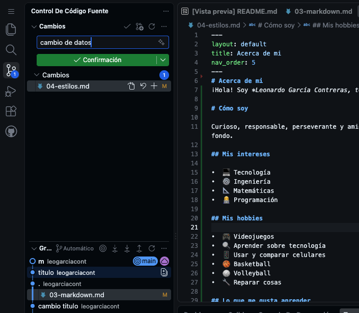
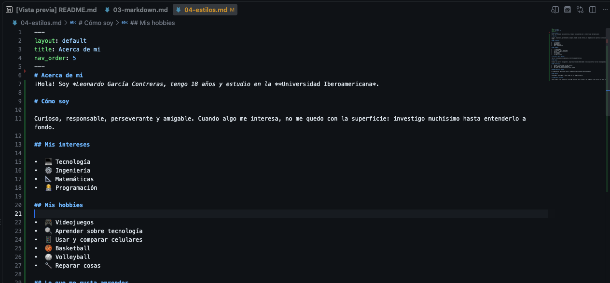
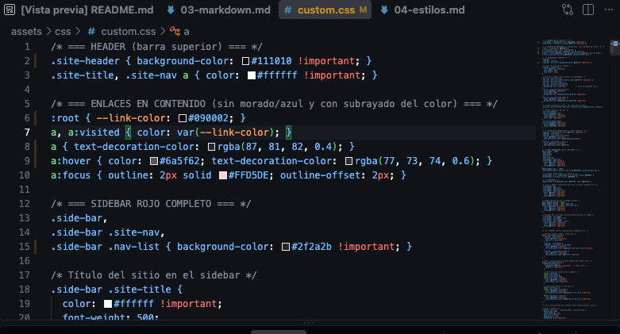

# Semana 1

Esta primera semana estuvo enfocada en comenzar a personalizar mi página web hecha con GitHub Pages. A continuación documento paso a paso todo el proceso que seguí, desde los primeros cambios hasta los obstáculos que me encontré en el camino.

## Paso 1: Explorar la estructura del repositorio

Antes de modificar cualquier cosa, dediqué tiempo a explorar la estructura del repositorio base para entender qué archivos existían y para qué servía cada uno:

- Revisé carpetas como `_includes` y `assets`.
- Estudié el archivo `_config.yml`, que controla la configuración general del sitio.
- Leí la documentación que ya venía en el repo sobre cómo publicar en GitHub Pages y cómo estaba organizada la estructura.

Quería entender bien el terreno antes de empezar a hacer cambios sin saber qué estaba tocando.

## Paso 2: Cambiar títulos y orden de navegación

Modifiqué el campo `title` dentro del front matter (la sección entre `---` al inicio de cada archivo Markdown) para renombrar cada página. En ese mismo bloque descubrí otros campos importantes:

- `layout`: controla el diseño general de la página.
- `nav_order`: define el orden en el que cada página aparece en el menú lateral.

Estuve probando distintas combinaciones de `nav_order` hasta lograr un menú con un orden lógico para quien visite mi portafolio.

**Obstáculo encontrado:** cambiaba el `title` de un archivo (por ejemplo `03-markdown.md`) y esperaba ver el nuevo título en el panel de archivos del editor, pero seguía mostrando el nombre del archivo tal cual. Pensé que el cambio no funcionaba, hasta que entendí que el panel de archivos siempre muestra el *nombre del archivo*, mientras que el `title` solo se refleja una vez publicada la página, en el menú de navegación y en el encabezado del navegador. Nombre de archivo y título de página son cosas distintas.



## Paso 3: Escribir la sección "Acerca de mí"
Esta fue la parte que más tiempo me llevó. Agregué mi información personal:

- Quién soy y en dónde estudio.
- Mi experiencia previa.
- Mis intereses y hobbies.
- Mis metas a futuro.
- Mis fortalezas y áreas en las que quiero mejorar.



Quise que se sintiera como una pequeña autobiografía y no solo una lista de datos sueltos, así que reescribí el contenido varias veces hasta que sentí que reflejaba quién soy realmente.

## Paso 4: Entender el flujo de publicación (commit y push)

Durante el proceso me surgió una duda técnica recurrente: mis cambios no se veían reflejados en la página publicada aunque los hubiera guardado en el editor. Le pedí ayuda a Claude (un chat de inteligencia artificial), quien me explicó el flujo completo:

1. Guardar los cambios localmente en el editor.
2. Hacer **commit** para registrar los cambios en el control de versiones.
3. Hacer **push** para subirlos al repositorio remoto en GitHub.
4. Esperar a que el sitio se reconstruya en segundo plano.
5. Refrescar el navegador limpiando la caché (`Ctrl+Shift+R`) para ver la versión más reciente.

Con esa explicación entendí mucho mejor el flujo entre editar → guardar → commit → push → esperar reconstrucción, algo que al inicio de la semana no me quedaba nada claro.


## Paso 5: Cambiar los colores del sitio

Modifiqué el archivo `custom.css` para ajustar la paleta de colores:

1. Ubiqué las variables de color dentro de `assets/css/custom.css`.
2. Cambié el color principal de [color anterior] a [color nuevo].
3. Guardé, hice commit y push para ver el cambio reflejado.



## Paso 6: Agregar mi foto de perfil

1. Subí mi foto a la carpeta `assets/img`.
2. Referencié la imagen en el archivo correspondiente usando la ruta relativa.
3. Verifiqué que se viera bien en distintos tamaños de pantalla.
-->
## Paso 7: Agregar el link de Instagram

Quise agregar un enlace a mi Instagram en la parte superior del sitio, junto al buscador. Para esto usé la opción `aux_links` dentro de `_config.yml`:


aux_links:
  "instagram":
    - "https://instagram.com/leo_gxc_"
  "Repositorio en GitHub":
    - "https://github.com/HuberGiron/portafolio-just-the-docs"
```

Obstáculo encontrado: al principio escribí `"instagram":` al mismo nivel de indentación que `aux_links:`, sin darme cuenta de que en YAML la indentación define la jerarquía. Al estar al mismo nivel, el archivo no lo interpretaba como parte de `aux_links`, sino como una clave aparte, así que el link ni siquiera aparecía en la página. Le agregué dos espacios de indentación para que quedara anidado correctamente debajo de `aux_links`, y con eso el link empezó a mostrarse en el sitio.

Segundo obstáculo: una vez que el link ya aparecía visualmente, al darle clic me mandaba a una página rota dentro de mi propio sitio en lugar de a Instagram. Después de revisar con calma, encontré que había un error de sintaxis en esa parte del archivo. Al corregirlo, hice `commit` y `push` de los cambios, esperé a que GitHub Pages reconstruyera el sitio, y finalmente el link funcionó correctamente.

![Figura 4– Captura de Pantalla]
(assets/img/03-markdown/Captura de Pantalla.png)


## Conclusión

Esta primera semana me sirvió muchísimo para entender cómo está estructurado mi portafolio, cómo funciona el flujo de trabajo entre Jekyll y GitHub Pages, la diferencia entre el nombre de un archivo y el título de una página, y qué pasos son necesarios para que cualquier cambio se vea reflejado correctamente en la página publicada. Aunque tuve varias dudas en el camino, ahora tengo mucho más claro el proceso completo, lo cual me servirá para las próximas semanas del curso.